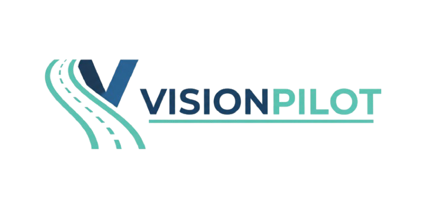
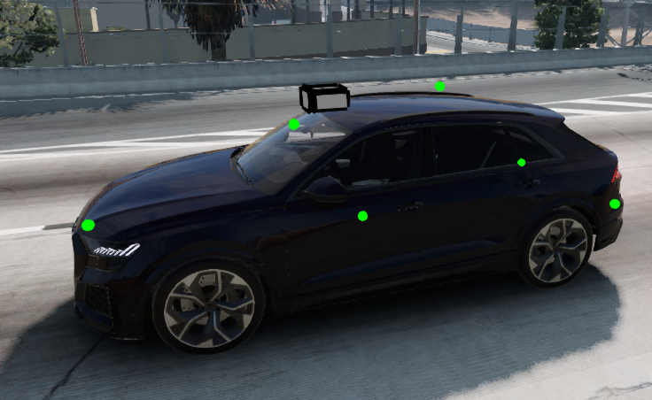
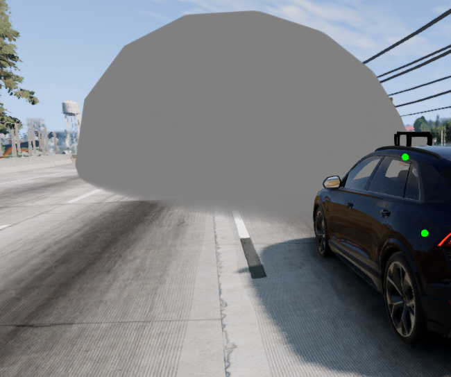
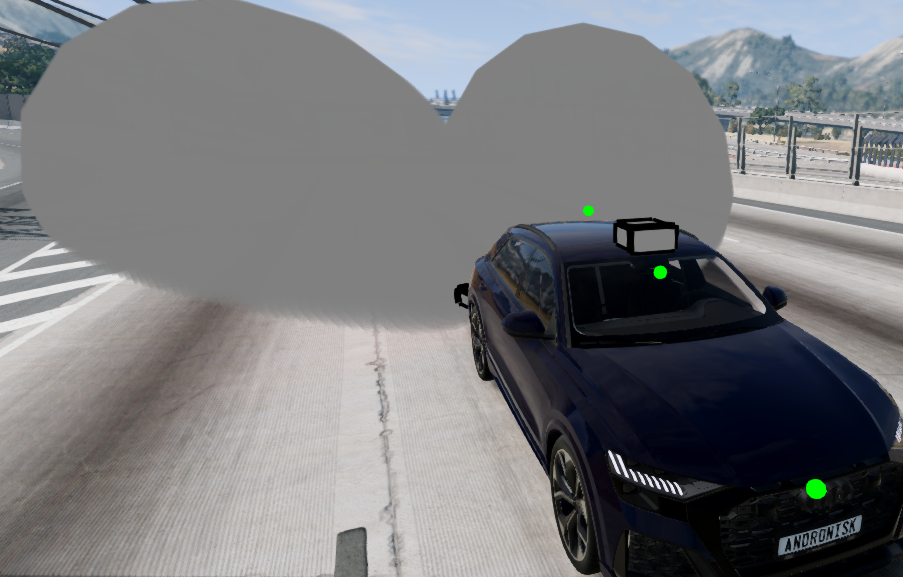
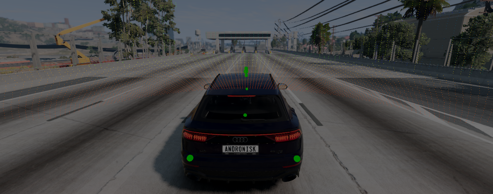

<p align="center">
  
</p>

# VisionPilot: Autonomous Driving Simulation, Computer Vision & Real-Time Perception (BeamNG.tech)

<p align="center" style="margin-bottom:0;">
  
</p>

## Overview

A modular Python project for autonomous driving research and prototyping, fully integrated with the BeamNG.tech simulator and Foxglove visualization. This system combines traditional computer vision algorithms and deep learning (CNN, UFLD) with real-time sensor fusion and autonomous vehicle control to tackle:

- **Multi-Lane Detection**: UFLD, Traditional CV
- **Traffic Sign**: Classification & Detection
- **Traffic Lights**: Classification & Detection
- **Multi-Class Object Detection**: Vehicles, pedestrians, cyclists and more
- **Multi-Sensor Fusion**: Camera, Lidar, Radar, GPS, IMU<!-- - **Microservices Architecture**: Containerized multi-model inference (Docker), orchestrated via central aggregator -->
- **Real-Time Control**: PID steering, cruise control (CC), automatic emergency braking (AEB)
- **Visualization**: Real-time monitoring with Foxglove WebSocket + multiple CV windows
- **Configuration System**: YAML-based modular settings
  
> **Looking Ahead**: While VisionPilot currently runs on BeamNG.tech, integration with the **CARLA Simulator** is planned on our roadmap. If you are interested in helping build the CARLA bridge, PRs are welcome and much appreciated!
  
## Table of Contents

- [VisionPilot: Autonomous Driving Simulation, Computer Vision \& Real-Time Perception (BeamNG.tech)](#visionpilot-autonomous-driving-simulation-computer-vision--real-time-perception-beamngtech)
  - [Overview](#overview)
  - [Table of Contents](#table-of-contents)
  - [Usage](#usage)
  - [Demos](#demos)
    - [Multi-Lane Detection Stress Testing](#multi-lane-detection-stress-testing)
    - [Emergency Braking (AEB)](#emergency-braking-aeb-demo)
    - [Blind Spot Detection (BSD)](#blind-spot-detection-bsd)
    - [Sign Detection \& Classification](#sign-detection--classification)
    - [Traffic Light Detection \& Classification](#traffic-light-detection--classification-demo)
    - [Lane Detection & Keeping (v2)](#lane-detection--keeping-v2)
    - [Previous Lane Detection & Keeping (v1)](#previous-lane-detection--keeping-v1)
    - [Ultra-Fast Lane Detection (UFLD)](#ultra-fast-lane-detection-ufld)
    - [Foxglove Visualization](#foxglove-visualization)
    - [Multi Camera Scene Segmentation](#multi-camera-scene-segmentation)
  - [Sensor Suite](#sensor-suite)
  <!-- - [Microservices Architecture](#microservices-architecture) -->
  - [Roadmap](#roadmap)
  - [Note on Installation](#note-on-installation)
  - [Known Limitations](#known-limitations)
  - [Credits](#credits)
  - [License](#license)


## Usage

### 1. Download BeamNG.tech

First, download and install BeamNG.tech from the [official website](https://www.beamng.tech/). This is required to run the simulation environment.

### 2. Configure BeamNG Path

Navigate to the `config` directory and update the path to your BeamNG.tech installation in the configuration files.

**Configuration Files Overview:**

| File | Purpose |
|------|---------|
| **beamng.yaml** | Main configuration file containing the path to your BeamNG.tech installation. **Required for basic setup** |
| **config.py** | Python configuration module that loads and manages all YAML settings |
| **control.yaml** | Steering, throttle, and braking control parameters (PID tuning) |
| **perception.yaml** | Computer vision pipeline settings (lane detection, object detection thresholds) |
| **scenarios.yaml** | Simulation scenario definitions and test environments |
| **sensors.yaml** | Sensor configuration (camera, LiDAR, radar parameters) |

Update **`beamng.yaml`** with your BeamNG.tech installation path. For basic usage, this is the only essential configuration file you need to modify. Advanced users can also customize `sensors.yaml` to adjust sensor parameters.

### 3. Download Pretrained Models

Download the pretrained models for object detection, traffic light detection, traffic sign detection, and classification from the **[VisionPilot v0.1.0-alpha Release](https://github.com/visionpilot-project/VisionPilot/releases/tag/v0.1.0-alpha)**. Extract the downloaded model package into the `models` root folder with the following structure:

> **Note:** Pretrained models are provided with the **v0.1.0-alpha release**. Download the `visionpilot-v0.1.0-models.zip` package from the release assets and extract its contents into the `models` folder.

```text
models/
├── object_detection/
│   └── object_detection.pt
├── traffic_light/
│   └── traffic_light_detection.pt
├── traffic_sign/
│   ├── traffic_sign_detection.pt
│   └── traffic_sign_classification.h5
└── ufld/
    └── ufld_culane_res18.pth
```
### 4. Specify Model Paths

Verify that the model loading section in your main script matches your model directory structure:

```python
print("[Main] Loading local models...")
local_models = {}
local_models['vehicle'] = YOLO('models/object_detection/object_detection.pt')
local_models['traffic_light'] = YOLO('models/traffic_light/traffic_light_detection.pt')
local_models['sign_detect'] = YOLO('models/traffic_sign/traffic_sign_detection.pt')
local_models['sign_classify'] = load_model('models/traffic_sign/traffic_sign_classification.h5')
```

Update these paths if your model structure differs from the default.

#### UFLD Lane Detection Model

VisionPilot includes the required UFLDv2 code and configuration files. No separate UFLDv2 repository is required.

In `src/perception/lane_detection/main.py`, verify:

```python
model_path = MODELS_DIR / "ufld" / "ufld_culane_res18.pth"
```
Ensure the `ufld_culane_res18.pth` model weights are available before running the simulation.

### 5. Start the Simulation

Navigate to the `scripts` directory and run the startup script:

Linux/macOS:

```bash
cd scripts
./start_simulation.sh
```

Windows Powershell:
```bash
cd scripts
start_simulation.bat
```

The simulation will initialize BeamNG.tech, load the perception models, and begin streaming sensor data and AI predictions in real-time.

## Demos

### Multi-Lane Detection Stress Testing
Evaluation of the multi-lane perception pipeline across various environmental edge cases, including high-glare transitions, low-light tunnels, and heavy atmospheric fog:


**Extended Demo:** [Watch the full video here](https://youtu.be/IvmJ01pYCSE)

---

### Emergency Braking (AEB)

Watch the Emergency Braking System (AEB) in action with real-time radar filtering and collision avoidance:


**Extended Demo:** [Watch the full video here](https://www.youtube.com/watch?v=Z8Y2-MpmrRg)

<!--
---

### Blind Spot Detection (BSD)
See the Blind Spot Detection (BSD) system in action using radar data to identify vehicles in the blind spot:

**Extended Demo:** [Watch the full video here](https://www.youtube.com/watch?v=Z8Y2-MpmrRg)

-->

---

### Sign Detection & Classification

This demo shows real-time traffic sign detection and classification:


**Extended Demo:** [Watch the full video here](https://youtu.be/ujGkQJ2BqV0)

> VisionPilot does not yet support multi-camera. This is for demonstration purposes only.

---

### Traffic Light Detection & Classification

This demo shows real-time traffic light detection and classification:


> No extended Demo avaliable yet.

---

### Lane Detection & Keeping (v2)

Watch the improved autonomous lane keeping demo (v2) in BeamNG.tech, featuring smoother fused CV+SCNN lane detection, stable PID steering, and robust cruise control:


**Extended Demo:** [Watch the full video here](https://www.youtube.com/watch?v=7eA_XfIkLWQ)

> Note: Very low-light (tunnel) scenarios are not yet supported.

### Previous Lane Detection & Keeping (v1)

The original demo is still available for reference:

[Lane Keeping & Multi-Model Detection Demo (v1)](https://youtu.be/f9mHigMKME8)

---

### Ultra-Fast Lane Detection (UFLD)
Watch the UFLD perform real-time lane detection with temporal spline smoothing on highway video.


**Extended Demo:** [Watch the full video here](https://youtu.be/Dkj-diRK334)

> Note: Because UFLDv2 operates as an internal feature module in VisionPilot's multi-feature voting pipeline, this standalone demo highlights the underlying model's perception capabilities before its output is merged into the final pixel voting matrix.

---

### Foxglove Visualization

See real-time LiDAR point cloud streaming and autonomous vehicle telemetry in Foxglove Studio:


**Extended Demo:** [Watch the full video here](https://www.youtube.com/watch?v=4HJDvL2Q6AY)

---

### Multi Camera Scene Segmentation

See real-time image segmentation using front and rear cameras:


**Extended Demo:** [Watch the full video here](https://youtu.be/4PAqcUKqn6c?si=UHw-mw7iLZKGXvav)

---

> More demo videos and visualizations will be added as features are completed.

## Sensor Suite

The vehicle is equipped with a comprehensive multi-sensor suite for autonomous perception and control:

| Sensor                      | Specification                                        | Purpose                                                         |
| --------------------------- | ---------------------------------------------------- | --------------------------------------------------------------- |
| **Front Camera**            | 1920x1080 @ 50Hz, 70° FOV, Depth enabled             | Lane detection, traffic signs, traffic lights, object detection |
| **LiDAR (Top)**             | 80 vertical lines, 360° horizontal, 120m range, 20Hz | Obstacle detection, 3D scene understanding                      |
| **Front Radar**             | 200m range, 128×64 bins, 50Hz                        | Collision avoidance, adaptive cruise control                    |
| **Rear Left & Right Radar** | 30m range, 64×32 bins, 50Hz                          | Blindspot monitoring, rear object detection                     |
| **Dual GPS**                | Front & rear positioning @ 50Hz                      | Localization                                                    |
| **IMU**                     | 100Hz update rate                                    | Vehicle dynamics, pose estimation                               |

<table>
  <tr>
    <td align="center"></td>
    <td align="center"></td>
    <td align="center"></td>
    <td align="center"></td>
  </tr>
  <tr>
    <td align="center"><em>Sensor Array</em></td>
    <td align="center"><em>Front Radar</em></td>
    <td align="center"><em>Rear Radars</em></td>
    <td align="center"><em>Lidar Visualization</em></td>
  </tr>
</table>

> Configuration files are located in the `/config` directory:

<!--

## Microservices Architecture

> **Note:** The microservices architecture is documented below as the intended design. **Currently, for active development and rapid iteration, all perception models run locally in-process** (bypassing Docker containers and the aggregator). This allows faster prototyping and validation of the complete pipeline. The containerized microservices will be re-integrated once the core perception, sensor fusion, and control systems are finalized and validated.

VisionPilot is designed to use a **containerized microservices architecture** where each perception task runs as an independent Flask service, orchestrated by a central Aggregator:

### Service Stack (Intended Design)

| Service | Port | Function | Model/Framework |
|---------|------|----------|-----------------|
| **Object Detection** | 5777 | Vehicle, pedestrian, cyclist detection | YOLOv11 |
| **Traffic Light Detection** | 6777 | Traffic light detection & state classification | YOLOv11 |
| **Sign Detection** | 7777 | Traffic sign detection | YOLOv11 |
| **Sign Classification** | 8777 | Traffic sign type classification | CNN |
| **YOLOP** | 9777 | Unified: lanes + drivable area + objects | YOLOPX |

### Data Flow

```
BeamNG Simulation Loop
    ↓
PerceptionClient.process_frame()
    ↓
Aggregator (concurrent orchestration)
    ├─→ Object Detection (5777)
    ├─→ Traffic Light (6777)
    ├─→ Sign Detection (7777)
    ├─→ Sign Classification (8777)
    └─→ YOLOP (9777)
    ↓
Merge all responses
    ↓
Return unified AggregationResult
    ↓
Extract individual results + visualize
```

### Benefits

**Concurrency**: All services run in parallel (ThreadPoolExecutor)  
**Modularity**: Add/remove services without modifying BeamNG code  
**Scalability**: Easy horizontal scaling with container orchestration  
**Fault Tolerance**: Individual service failures don't break the pipeline  
**Reusability**: Services can be used independently or together

-->

## Roadmap

### Perception

- [ ] 2D Object & Scene Detection
  - [x] Sign classification & Detection (CNN / YOLO)
  - [x] Traffic light classification & Detection (CNN / YOLO)
  - [x] Multi-class object detection (Cars, Trucks, Buses, Pedestrians, Cyclists)
  - [ ] Road Marking Detection (Arrows, Crosswalks, Stop Lines)

- [ ] 3D Perception & Spatial Estimation
  - [ ] Speed Estimation using detection from camera and lidar
  - [ ] Lidar Object Detection
  - [ ] 💤 Multi Camera Setup (Will implement after all other camera-based features are finished)
  - [ ] Multi-Object Tracking (MOT)
  
- [x] Lane & Drivable Area Segmentation
  - [x] Lane detection Fusion (UFLD / CV)
  - [x] 🔥 Ultra Fast Lane Detection (UFLD) integration
  - [x] Traditional CV Lane Detection (with Majority Voting & Lighting condition Detection)
    - [x] Improve voting system and add additional features
    - [x] Lighting Condition Detection
  - [x] Detect multiple lanes
  - [x] 🔥 Handle dashed lines better in lane detection

### Sensor Fusion

- [ ] Sensor Hardware Integration
  - [x] Integrate Radar
  - [x] Integrate Lidar
  - [ ] Integrate GPS
  - [ ] Integrate IMU
  - [ ] 💤 Ultrasonic Sensor Integration

- [ ] State Estimation & Mapping
  - [ ] Kalman Filtering (Standard & Extended)
  - [ ] 💤 SLAM (simultaneous localization and mapping)
    - [ ] Build HD Map of the BeamNG.tech map
    - [ ] Localize Vehicle on HD Map

### Control & Planning

- [ ] Low Level Motion Control
  - [x] Vehicle Control integration (Throttle, Steering, Braking)
  - [x] Integrate PIDF controller for steering and speed control
  - [ ] 💤 Model Predictive Control (MPC) for more advanced control strategies

- [ ] Safety & Driving Assist
  - [ ] Adaptive Cruise Control (ACC)
    - [x] Cruise Control (CC)
  - [x] Automatic Emergency Braking (AEB)
  - [x] 🔥 Blind Spot Monitoring (BSD)
  - [ ] Dynamic Target Speed
  - [ ] Curve Speed Optimization
  
- [ ] Tactical & Behavior Planning
  - [ ] Behavior Tree Architecture (Stop, Yield, Lane Change, Overtake)
  - [ ] Traffic Rule Enforcement (Stop at red lights, stop signs, yield signs)
  - [ ] 🔥 Lane Change Logic (Check Blindspot, Signal, Execute)
  - [ ] Obstacle Avoidance (Depends on Behavior Tree)
  - [ ] Parking Logic (Parallel / Perpendicular Path Finding)

- [ ] Trajectory & Path Planning
  - [ ] Frenet Frame Transformation
  - [ ] Global Path Planning
  - [ ] Local Path Planning
  - [ ] Trajectory Prediction (Surrounding Vehicle Intent) 

### Simulation & Scenarios

- [x] Integrate and test in BeamNG.tech simulation
- [x] Modularize and clean up BeamNG.tech pipeline
- [ ] **CARLA Simulator Integration** (Planned / Help Wanted)
  > *Note: CARLA support is planned for multi-simulator testing, but active development hasn't started yet. PRs and community contributions are very welcome!*
- [ ] Environmental Conditions (Fog, Night, Dawn/Dusk, Tunnels/Low-Light)
- [ ] Traffic scenarios (Light, Moderate, Heavy)
- [ ] 💤 Physical RC Deployment

### Visualization & Logging

- [x] ⭐ Full Foxglove visualization integration (Overhaul needed)
- [x] Modular YAML configuration system
- [x] Real-time drive logging and telemetry

> **Note:** Considering moving away from Foxglove entirely to build a custom dashboard. Not a priority at this time.

- [ ] Spatial & Path Visualization
  - [ ] 🔥 Birds-Eye View (BEV)
  - [ ] Inverse Perspective Mapping (IPM)
  - [ ] Map & Real Time Perception Overlay
  - [ ] Trajectory & Path Plan Overlays in Foxglove

### Deployment & Infrastructure

- [ ] 💤 Microservices Architecture
  - [ ] Containerize models with Docker
  - [ ] Aggregator service for concurrent inference orchestration
  - [ ] Message Broker (Redis)

### Meta & Documentation

- [x] Vibe-Code a website for the project
- [x] Redo project structure for better modularity
- [x] README Demo Media
- [ ] Performance Benchmarks
- [ ] Documentation
- [x] First release with pre-trained models

## Legend

> 🔥  High Priority

> ⭐  Refining / In Progress (Working baseline, needs tuning and improvements)

> 💤  Backlog / Postponed (Nice to have, deferred)


## Note on Installation

> **Status:** This project is currently in **active development**. A stable, production-ready release with pre-trained models and complete documentation will be available eventually.

## Known Limitations

- **Simulator Support**: Currently only validated in BeamNG.tech. CARLA simulator integration is planned, but not yet implemented.
- **Tunnel/Low-Light Scenarios**: Camera perception fails below certain lighting thresholds
- **Multi-Camera Support**: Single front-facing camera only (future roadmap)
- **PID Controller Tuning**: May oscillate on tight curves
- **Real-World Testing**: Only validated in simulation (BeamNG.tech), for now...

## Credits

**Datasets:**

- CU Lane, LISA, GTSRB, Mapillary, BDD100K

**Simulation & Tools:**

- BeamNG.tech by [BeamNG GmbH](https://www.beamng.tech/)
- Foxglove Studio for visualization
- Docker & Docker Compose for containerization

**Special Thanks:**

- Kaggle for free GPU resources (Model Training)
- Mr. Pratt (Teacher/Supervisor) for guidance

## Acknowledgements

**Academic Papers & Research:**

Ultra Fast Deep Lane Detection v2
```bibtex
@ARTICLE{qin2022ultrav2,
  author={Qin, Zequn and Zhang, Pengyi and Li, Xi},
  journal={IEEE Transactions on Pattern Analysis and Machine Intelligence}, 
  title={Ultra Fast Deep Lane Detection With Hybrid Anchor Driven Ordinal Classification}, 
  year={2022},
  doi={10.1109/TPAMI.2022.3182097}
}
```

## Citation

If you use VisionPilot in your project, please cite:

```bibtex
@software{visionpilot2026,
  title={VisionPilot: Autonomous Driving Simulation, Computer Vision & Real-Time Perception},
  author={Julian Stamm},
  year={2026},
  url={https://github.com/visionpilot-project/VisionPilot}
}
```

### BeamNG.tech Citation

> **Title:** BeamNG.tech  
> **Author:** BeamNG GmbH  
> **Address:** Bremen, Germany  
> **Year:** 2025  
> **Version:** 0.35.0.0  
> **URL:** https://www.beamng.tech/

## License

This project is licensed under the MIT License - see [LICENSE](LICENSE) file for details.
